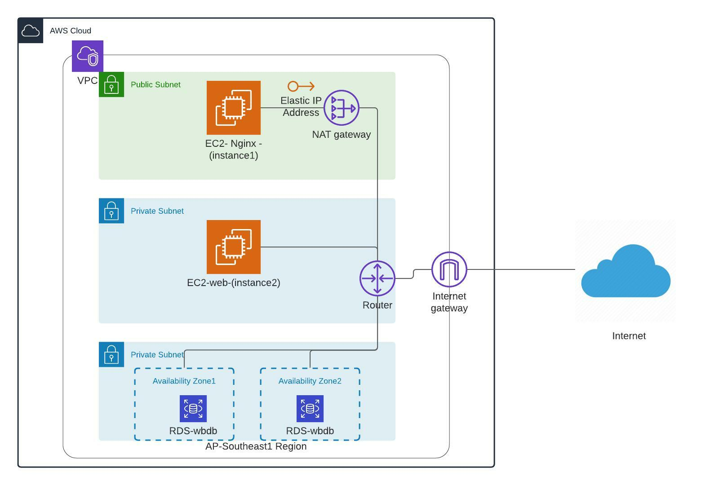

# Challenge1

A 3-tier environment is a common setup. Use a tool of your choosing/familiarity create these resources. Please remember we will not be judged on the outcome but more focusing on the approach, style and reproducibility.

**Three-Tier Architecture Overview**

The three-tier architecture is the most popular implementation of a multi-tier architecture and consists of a single presentation tier, logic tier, and data tier. This architecture is used in a client-server application such as a web application that has the frontend, the backend, and the database. Each of these layers or tiers does a specific task and can be managed independently of each other.

**Pre-Requisites**

. Install Terraform
. Install AWS CLI
. Signup for an AWS Account
. Create IAM Programattic User and configure AWS Access Key and AWS Secret Key

**AWS**

Amazon Web Service (AWS) is a cloud platform that provides different cloud computing services, we are using AWS Services for completing this challenge and build a three tier cloud infrastructure.

**Terraform**

For Fullfilling this challenge, I am taking Terraform as IAC,HashiCorp Terraform is a tool for building, changing, and versioning infrastructure that has an open-source and enterprise version. Terraform is cloud agnostic and can be used to create multi-cloud infrastructure, which uses HCL(HarshiCorp Configuration Language) for IAC.

**Solution**

Below are the parts or steps which we create while creating 3 -tier Architecture in AWS:

1. Virtual Private Cloud (VPC):

2. Setup the Internet Gateway:

3. Create 3 Subnets :

4. Create Two Route Tables with route table Association:

5. Create the NAT Gateway:

6. Create RDS for storage :

We will create below Architecture in 3 tier:

**Overview**

1: Create a VPC with a CIDR Range:

Providers.tf, is the file where we can provide AWS IAM User access key and secret key, which is not recommended way, we can configure VM for giving secret and access key as well we can provide region also in the same file.

vpc.tf, is the file to create our own VPC for three tier architecture in AWS.

2: Set Internet Gateway to connect with VPC

internet.tf, is the file to create internet gateway and the internet access to route to access the internet.

3: Create 3 subnet as one as public and 2 private subnets, with route table and route table association.

public.tf, create a public subnet with VPC. Public route tables connect with VPC, public route is connected with nat based on Internet Gateway. Subnet table association with public subnet and public route table.

private.tf and private2.tf, create private subnet with VPC, private route table connects with VPC. The private route is connected with NAT based on Internet Gateway, subnet table association with private subnet and private route table.

4: Create NAT Gateway for private instance to get Internet path from the public to private.

nat.tf, file will create the nat for internet access to the private instances.

eip.tf, file will create Elastic IP for attaching with nginx server which is present in public subnet.

5: Create Security Group for instances

sg.tf, is a file that acts as a firewall for our instance. Who will access our instance permissions port assigning, and all ingress and egress to access inside our instances to access public internet.

6: Create RDS Storage to store the data of the application into the database. That database is called RDS.

rds.tf, RDS Instance saves the data of my application and acts as a database server.

7: Create Instances, for running nginx server and backend servers we are using EC2 Instances.

instance1.tf, instance2.tf Create pubic instance with Security Group, key and instance specification. Because the webserver is in public, need to configure Nginx. instance2.tf create an instance where backend will be running, we can run any php or CMS related proj into it as well connect through mysql so that instance2 will be connected with database and nginx will run as frontend proxy server.

